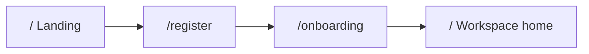

# Luồng đăng ký và tạo workspace

Người đại diện doanh nghiệp tạo tài khoản admin, tạo workspace, rồi vào homepage của workspace đó. Copy UI bằng tiếng Anh. Brand: **Sperraw**.

Wizard onboarding là nhiều bước trên `/onboarding`. Mỗi bước phải hợp lệ mới sang bước tiếp. Có thể quay lại bước trước. Account, workspace, và data wizard (`stepIndex`, tên/slug, forwarding, invites) persist `sessionStorage` — về home hoặc refresh tab vẫn giữ login và form đã lưu.

## Happy path

```
/                    Landing — CTA “Create workspace”
/register            Tạo tài khoản admin
/onboarding          Wizard: workspace → forwarding → invite → done
/                    Homepage workspace (khi đã có workspace)
```



Tạo **account** và tạo **workspace** là hai API riêng. Workspace gắn với session account vừa đăng ký. Một account chỉ có một workspace.

## Guard

`AuthGuard` bọc toàn app trong root layout. Session account nằm ở `useAuthStore`.

| Route | Chưa login | Đã login, chưa có workspace | Đã login, đã có workspace |
| --- | --- | --- | --- |
| `/` | Landing | Landing + *Continue setup* | Workspace home |
| `/register` | Form đăng ký | Redirect `/onboarding` | Redirect `/` |
| `/onboarding` | Redirect `/register` | Wizard | Vẫn vào được wizard (để hoàn tất bước còn lại) |

Logout (`POST /api/auth/logout`) xoá session + reset onboarding store, về landing.

## 1. Landing — `/`

- Value proposition: Recognition & Rewards, tạo workspace để bắt đầu.
- CTA **Create workspace** → `/register`.
- Nếu đã login nhưng chưa có workspace: CTA **Continue setup** → `/onboarding`.
- “Already have an account?” là placeholder (chưa có login).

## 2. Đăng ký admin — `/register`

Người đăng ký = admin của workspace sắp tạo.

| Field | Bắt buộc | Validation |
| --- | --- | --- |
| Full name | Có | 2–80 ký tự, trim |
| Work email | Có | Email hợp lệ |
| Password | Có | ≥ 8 ký tự, có chữ và số |
| Confirm password | Có | Trùng password |

Hành vi:

- Submit → `POST /api/auth/register`.
- Thành công → lưu account vào auth store, toast *Account created*, sang `/onboarding`.
- Email đã tồn tại hoặc reserved → `409`, lỗi inline trên email.
- Payload không hợp lệ → `400`.

Email reserved (luôn bị coi là đã đăng ký): `nasbui.r@example.net`, `demo@sperraw.app`.

## 3. Wizard — `/onboarding`

Bốn bước trong stepper. Không nhảy cóc: chỉ click được bước `index <= stepIndex`.

| # | Bước | Tạo resource phía API? |
| --- | --- | --- |
| 1 | Add Workspace | Có — `POST /api/onboarding/workspace` |
| 2 | Set up email forwarding | Không |
| 3 | Invite your team | Không (chỉ lưu client) |
| 4 | You're all set | Không |

### 3.1 Add Workspace

Workspace là tenant. Preview URL: `sperraw.app/w/{slug}`.

| Field | Bắt buộc | Validation |
| --- | --- | --- |
| Workspace name | Có | 2–50 ký tự |
| Slug | Có | `a-z`, `0-9`, `-`; 3–32 ký tự; không bắt đầu/kết thúc bằng `-`; không `--` |

Hành vi:

- Slug auto-generate từ tên (NFD, bỏ dấu, lowercase, ký tự khác `a-z0-9` → `-`, cắt 32).
- User sửa slug được; nếu đã sửa tay thì đổi tên không ghi đè slug.
- Debounce ~400ms → `GET /api/onboarding/slug?value=` để check uniqueness.
- Slug reserved luôn unavailable: `demo`, `admin`, `www`.
- Submit **Save and continue** → `POST /api/onboarding/workspace` (cần session).
- Thành công → lưu `id`, `name`, `slug` vào onboarding store, toast *Workspace created*, sang bước forwarding.
- Không có nút Back (đây là bước đầu wizard).

Lỗi API:

| Status | Khi nào | UI |
| --- | --- | --- |
| `401` | Chưa login | Lỗi trên slug |
| `400` | Name/slug không hợp lệ | Lỗi trên slug |
| `409` | Slug trùng, hoặc account đã có workspace | Lỗi trên slug |

Sau khi tạo workspace, các bước sau **không rollback** tenant. Quay lại bước này rồi submit lại sẽ `409` *You already have a workspace*.

### 3.2 Set up email forwarding

Địa chỉ forwarding lấy từ **email đã đăng ký** (fallback `{slug}@inbound.sperraw.app` nếu chưa có email). Có nút copy.

Phải tick xác nhận đã có quyền email đó. Bỏ tick → không sang bước sau.

### 3.3 Invite your team

Tuỳ chọn. Để trống rồi **Save and continue** = bỏ qua.

| Field | Bắt buộc | Validation |
| --- | --- | --- |
| Teammate emails | Không | Tách bằng dấu phẩy, `;`, hoặc xuống dòng; mỗi email hợp lệ; không trùng email admin |

Chưa gọi API invite. Danh sách giữ trên client.

### 3.4 You're all set

Tóm tắt tên workspace + URL. **Go to workspace** → `/`. Có Back về invite.

## 4. Homepage workspace — `/`

Khi đã login **và** đã có `workspaceId`:

- Header (logo, help, logout).
- Tên workspace, `sperraw.app/w/{slug}`.
- Placeholder Recognition & Rewards (chưa làm feature).
- Nếu wizard chưa tới bước cuối: nút **Finish workspace setup** → `/onboarding`.

Đây là nơi làm việc sau khi tạo workspace — không dùng route `/w/[slug]`.

## Trạng thái UI

Mỗi form bước:

- **Idle** — chưa submit
- **Submitting** — disable nút, label *Saving...*
- **Field error** — validation / API gắn field
- **Success** — chuyển bước hoặc về home

## Edge cases

| Tình huống | Xử lý |
| --- | --- |
| Refresh giữa wizard | Giữ login, workspace, và form/step đang dở |
| Vào `/` khi đã login | Có workspace → workspace home; chưa có → *Continue setup* (không bắt register lại) |
| Finish workspace setup | Mở lại wizard đúng bước đang dở, form đã điền sẵn |
| Vào `/register` khi đã login | Redirect onboarding hoặc home (nếu đã có workspace) |
| Vào `/onboarding` khi chưa login | Redirect `/register` |
| Click stepper bước chưa tới | `goTo` bỏ qua; không nhảy cóc |
| Slug bị lấy lúc đang gõ | Check debounce báo *Slug này đã được dùng*; submit API cũng `409` |
| Mất mạng khi tạo workspace | Lỗi trên slug, giữ form, cho retry |
| Tạo workspace rồi bấm logo về `/` | Hiện workspace home; có *Finish workspace setup* nếu chưa xong wizard |
| Logout | Xoá account + reset wizard, về landing |

## File chính

| Việc | File |
| --- | --- |
| Routes + guard lists | `src/consts/routes.ts` |
| AuthGuard | `src/features/auth/components/AuthGuard.tsx` |
| Form đăng ký | `src/features/auth/components/RegisterForm/` |
| Wizard | `src/features/onboarding/components/OnboardingWizard.tsx` |
| Bước tạo workspace | `src/features/onboarding/components/FormStep/StepCompany/` |
| Homepage | `src/features/home/HomePage.tsx`, `WorkspaceHome.tsx` |
| Client API | `src/lib/api/auth.ts`, `src/lib/api/onboarding.ts` |
| Mock MSW | `src/mocks/auth-handlers.ts`, `src/mocks/handlers.ts` |
